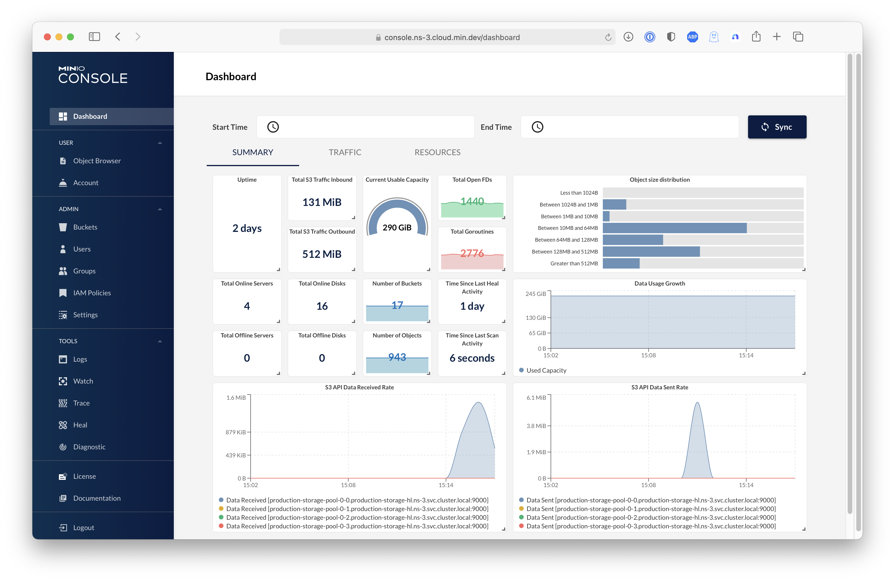
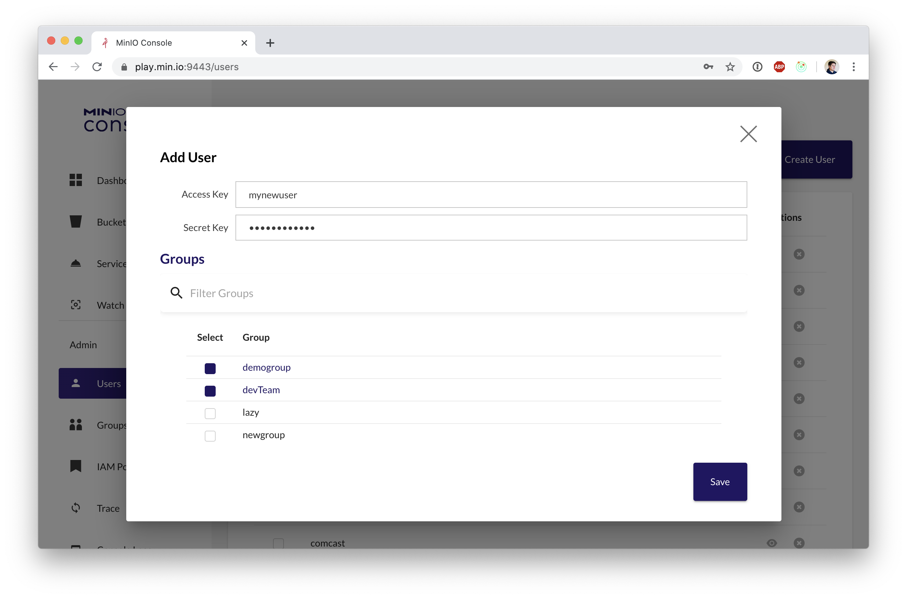

# MinIO Console

A graphical user interface for [MinIO](https://github.com/minio/minio)


| Dashboard  | Adding A User |
| ------------- | ------------- |
|   |  |

## Setup

All `console` needs is a MinIO user with admin privileges and URL pointing to your MinIO deployment.
> Note: We don't recommend using MinIO's Operator Credentials

1. Create a user for `console` using `mc`. 
```
$ set +o history
$ mc admin user add myminio console YOURCONSOLESECRET
$ set -o history
```

2. Create a policy for `console` with access to everything (for testing and debugging)

```
$ cat > consoleAdmin.json << EOF
{
	"Version": "2012-10-17",
	"Statement": [{
			"Action": [
				"admin:*"
			],
			"Effect": "Allow",
			"Sid": ""
		},
		{
			"Action": [
                "s3:*"
			],
			"Effect": "Allow",
			"Resource": [
				"arn:aws:s3:::*"
			],
			"Sid": ""
		}
	]
}
EOF
$ mc admin policy add myminio consoleAdmin consoleAdmin.json
```

3. Set the policy for the new `console` user

```
$ mc admin policy set myminio consoleAdmin user=console
```


### Note
Additionally, you can create policies to limit the privileges for `console` users, for example, if you want the user to only have access to dashboard, buckets, notifications and watch page, the policy should look like this:
```
{
	"Version": "2012-10-17",
	"Statement": [{
			"Action": [
				"admin:ServerInfo"
			],
			"Effect": "Allow",
			"Sid": ""
		},
		{
			"Action": [
				"s3:ListenBucketNotification",
				"s3:PutBucketNotification",
				"s3:GetBucketNotification",
				"s3:ListMultipartUploadParts",
				"s3:ListBucketMultipartUploads",
				"s3:ListBucket",
				"s3:HeadBucket",
				"s3:GetObject",
				"s3:GetBucketLocation",
				"s3:AbortMultipartUpload",
				"s3:CreateBucket",
				"s3:PutObject",
				"s3:DeleteObject",
				"s3:DeleteBucket",
				"s3:PutBucketPolicy",
				"s3:DeleteBucketPolicy",
				"s3:GetBucketPolicy"
			],
			"Effect": "Allow",
			"Resource": [
				"arn:aws:s3:::*"
			],
			"Sid": ""
		}
	]
}
```

## Run Console server
To run the server:

```
#required to encrypt jwet payload
export CONSOLE_PBKDF_PASSPHRASE=SECRET

#required to encrypt jwet payload
export CONSOLE_PBKDF_SALT=SECRET

export CONSOLE_ACCESS_KEY=console
export CONSOLE_SECRET_KEY=YOURCONSOLESECRET
export CONSOLE_MINIO_SERVER=http://localhost:9000
./console server
```

## Run Console with TLS enable

Copy your `public.crt` and `private.key` to `~/.console/certs`, then:

```bash
./console server
```

Additionally, `Console` has support for multiple certificates, clients can request them using `SNI`. It expects the following structure:

```bash
 certs/
  │
  ├─ public.crt
  ├─ private.key
  │
  ├─ example.com/
  │   │
  │   ├─ public.crt
  │   └─ private.key
  └─ foobar.org/
     │
     ├─ public.crt
     └─ private.key
  ...

```

Therefore, we read all filenames in the cert directory and check
for each directory whether it contains a public.crt and private.key.

## Connect Console to a Minio using TLS and a self-signed certificate

Copy the MinIO `ca.crt` under `~/.console/certs/CAs`, then:
```
export CONSOLE_MINIO_SERVER=https://localhost:9000
./console server
```

You can verify that the apis work by doing the request on `localhost:9090/api/v1/...`

# Contribute to console Project
Please follow console [Contributor's Guide](https://github.com/minio/console/blob/master/CONTRIBUTING.md)
